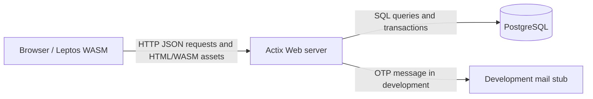

# Architecture

The walking skeleton is a modular monolith:

The browser never connects directly to PostgreSQL. The Actix server owns
authentication, request validation, authorization, and database access.
Dashboard statistics and health checks are read fresh from PostgreSQL for each
request.
