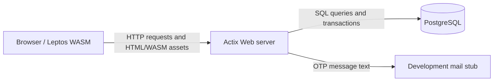
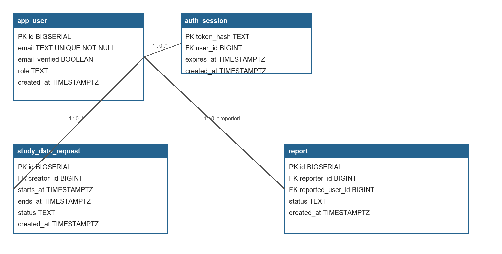

# NEUDating — Milestone 2 Design

## 1. Architecture

The walking skeleton is the admin console at `/admin_console`.



The browser never connects directly to PostgreSQL. The server owns routing,
authentication, validation, authorization, and database access. The arrows
are labelled with the data that crosses each boundary.

## 2. Data model



The ERD covers the four tables used by the walking skeleton.

| Table | Columns and constraints | Purpose and M1 rule |
|---|---|---|
| `app_user` | `id BIGSERIAL` PK; `email TEXT` UNIQUE NOT NULL; `email_verified BOOLEAN` NOT NULL; `role TEXT` NOT NULL; `created_at TIMESTAMPTZ` NOT NULL | Stores accounts. Lowercase `@neu.edu.vn` emails and verified status enforce the M1 campus-account rule. |
| `auth_session` | `token_hash TEXT` PK; `user_id BIGINT` FK to `app_user.id`; `expires_at TIMESTAMPTZ` NOT NULL; `created_at TIMESTAMPTZ` NOT NULL | Stores opaque login sessions and enforces expiry and account ownership. |
| `study_date_request` | `id BIGSERIAL` PK; `creator_id BIGINT` FK to `app_user.id`; `starts_at`, `ends_at TIMESTAMPTZ` NOT NULL; `status TEXT` NOT NULL; `created_at TIMESTAMPTZ` NOT NULL | Stores study-date requests. The status and `ends_at > starts_at` checks enforce valid lifecycle windows. |
| `report` | `id BIGSERIAL` PK; `reporter_id`, `reported_user_id BIGINT` FKs to `app_user.id`; `status TEXT` NOT NULL; `created_at TIMESTAMPTZ` NOT NULL | Stores moderation reports. `reporter_id <> reported_user_id` enforces the M1 no-self-report rule. |

## 3. API design

| Method | Path | Input | Success output | Error codes |
|---|---|---|---|---|
| `GET` | `/api/admin/statistics` | Admin session cookie | `200` with three counts | `401` unauthenticated; `403` non-admin; `500` database failure |
| `GET` | `/api/admin/health` | Admin session cookie | `200` with server/database status and timestamps | `401`; `403` |
| `POST` | `/api/auth/request-otp` | Email | `200` message | `400` invalid email; `500` persistence failure |
| `POST` | `/api/auth/verify-otp` | Email and six-digit OTP | `200` session cookie | `400` invalid/expired OTP; `401` mismatch |
| `POST` | `/api/match-requests` | Auth session and target user id | `201` request confirmation | `401`; `404` target missing; `409` duplicate request |
| `GET` | `/api/profiles/{id}` | Auth session and profile id | `200` profile and relationship | `401`; `404` profile missing |

Statistics are queried on every request, so refresh reads current stored data.
Database failures return an explicit error and the UI does not convert them to
zero-valued counts.

## 4. Walking skeleton

**Route:** `GET /admin_console`.

**Database tables:** `app_user`, `auth_session`, `study_date_request`, and
`report`. `database/seed.sql` creates ten users, two active requests, and one
pending report after migrations.

The statistics query is:

```sql
SELECT
  (SELECT COUNT(*) FROM app_user WHERE email_verified = TRUE),
  (SELECT COUNT(*) FROM study_date_request
   WHERE status = 'active'
     AND starts_at < now() + interval '24 hours'
     AND ends_at > now()),
  (SELECT COUNT(*) FROM report WHERE status = 'pending');
```

The end-to-end execution is:

| Step | Component | Action |
|---:|---|---|
| 1 | Browser | Open `/admin_console`. |
| 2 | Browser | Send `GET /api/admin/statistics` with the session cookie. |
| 3 | Actix | Parse the cookie and hash the opaque session token. |
| 4 | PostgreSQL | Look up the session and verify its expiry. |
| 5 | Actix | Verify that the session user has the `admin` role. |
| 6 | PostgreSQL | Execute the three `COUNT(*)` subqueries. |
| 7 | Actix | Serialize the typed JSON response. |
| 8 | Browser | Render registered users, active requests, and pending reports. |
| 9 | Browser | Display server and database health status. |
| 10 | Browser | Repeat the request when Refresh is clicked. |
| 11 | Browser | Display an error and Retry action if the request fails. |

Database migrations create the schema and `database/seed.sql` supplies the
fixture rows. The reproducible URL is
`http://localhost:3100/admin_console`. A screenshot of the running route with
the browser address bar visible is included in the final submitted PDF.

## 5. Design decisions (ADRs)

### ADR-1 — PostgreSQL instead of an in-memory store

**Options:** PostgreSQL, SQLite, or an in-memory vector. **Decision:** use
PostgreSQL because the app needs relational constraints, concurrent requests,
and production-like SQL. An in-memory vector would lose data and SQLite would
not match the deployment target. **Change trigger:** if the instructor's
fresh-machine test cannot complete in the time budget despite Docker and the
setup guide, evaluate a self-contained SQLite profile.

### ADR-2 — Server-side authorization instead of UI-only protection

**Options:** hide the route in the UI, enforce authorization in Actix, or use a
separate admin service. **Decision:** enforce it in Actix with an expiring
HttpOnly session and a role check. UI hiding is not a security boundary, while
a separate service is unnecessary for this slice. **Change trigger:** if
deployment requires independent scaling or a separate identity provider,
extract the admin API behind that provider.

## 6. What changed since M1

1. **The product gained a concrete admin dashboard slice.** Sprint 1 defined
   moderation and study-date concepts; Sprint 2 added measurable counts and
   health indicators so an administrator can observe platform usage.
2. **Authentication and authorization became explicit acceptance behavior.**
   The Sprint 1 review highlighted that an admin screen must not expose counts
   to anonymous or regular users, so the session, expiry, role, `401`, and
   `403` behaviors were added to the API and tested.

## Verification and submission metadata

| Field | Value |
|---|---|
| Team | QHQ |
| Topic | Walking skeleton: admin dashboard statistics and system health |
| Members | Nguyen Son Hai (`hai291`), Nguyen Minh Quang (`iambadwithname`), Pham Ha (`pham-ha-gif`) |
| Product Owner | `@hai291` |
| Scrum Master | `@pham-ha-gif` (Sprint 2; different from Sprint 1) |
| Repository | https://github.com/SE-FDA-NEU-AI66B/G8-DatingApp-AI66B |
| Project board | https://github.com/orgs/SE-FDA-NEU-AI66B/projects/20 |
| Setup guide | [docs/SETUP.md](./SETUP.md) |

Validation: `cargo check --features ssr`, `cargo test --lib --features ssr`,
and CI passed for the implementation PRs. The final PDF must include the
cover block, two project-board screenshots, and one browser screenshot with
the address bar visible.
