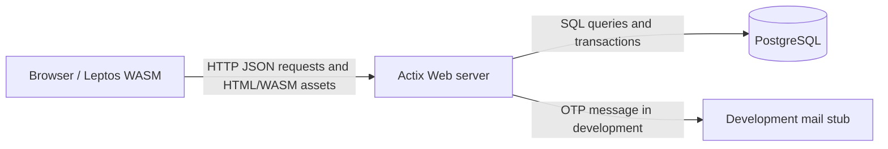

# NEUDating — Milestone 2 Design

## Submission metadata

| Field | Value |
|---|---|
| Team | QHQ |
| Topic | Walking skeleton: admin dashboard statistics and system health |
| Members | Nguyen Son Hai (`hai291`), Nguyen Minh Quang (`iambadwithname`), Pham Ha (`pham-ha-gif`) |
| Product Owner | `@hai291` |
| Scrum Master | `@pham-ha-gif` (Sprint 2) |
| Repository | https://github.com/SE-FDA-NEU-AI66B/G8-DatingApp-AI66B |
| Project board | https://github.com/orgs/SE-FDA-NEU-AI66B/projects/20 |
| Setup guide | [docs/SETUP.md](./SETUP.md) |

## Product slice

The delivered walking skeleton is the admin console at `/admin_console`.
It crosses the browser, Actix Web server, authentication boundary, and
PostgreSQL database. The page shows verified registered users, active
study-date requests, pending reports, and separate server/database health
statuses.

## Architecture

The browser never connects directly to PostgreSQL. The server owns
authentication, validation, authorization, and database access.

## Data and API design

`GET /api/admin/statistics` reads all three dashboard counts on every request:

- registered users are verified NEU accounts (`email_verified = TRUE`);
- active study dates overlap the current time and the next 24 hours;
- pending reports have `status = 'pending'`.

`GET /api/admin/health` checks the server response path and executes
`SELECT 1` against PostgreSQL. Each component returns its own status and
RFC3339 `checked_at` timestamp.

Both endpoints require an authenticated admin session. They return `401` for
missing/invalid sessions and `403` for authenticated non-admin users.
Database failures are returned as explicit errors and are never rendered as
zero-valued statistics.

## Verification evidence

- `cargo check --features ssr` passed.
- `cargo test --lib --features ssr` passed with 4 tests.
- CI build/test, Playwright harness, Windows Python tests, and secret scanning
  passed on the implementation pull request.

## Repository workflow

The design and setup documents are committed on a feature branch and submitted
through a pull request into `main`. A different team member must use GitHub's
**Review changes** flow, leave a substantive review comment, and approve before
merge. After merge, export this file to `Team<NN>_M2.pdf` and submit that one
PDF to the LMS.
